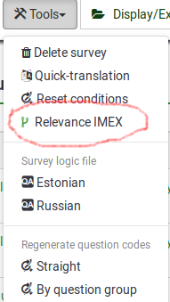

# LimeSurvey Structure Import/Export Plugin

[](https://github.com/TonisOrmisson/limesurvey-structure-imex/actions)
[](https://opensource.org/licenses/MIT)
[](https://php.net)

A LimeSurvey plugin for importing and exporting survey structure and relevance logic via Excel files.

# Installation & set-up
## Install to plugins folder

```
cd /LimeSurveyFolder/plugins
```


```
git clone https://github.com/TonisOrmisson/limesurvey-structure-imex.git  StructureImEx
```

```
cd StructureImEx && composer install
```

##
Activate plugin from Plugin manager

##
Find the plugin Import / Export buttons from survey tools menu.



# Updating

go to plugin folder
```
cd /LimeSurveyFolder/plugins/StructureImEx
```

Get updates via git.
`git pull` or `git fetch --all && git checkout my-version-tag`


Run install command to make sure dependencies are updated if necessary.
```
composer install --no-dev && composer dump-autoload
```

# Development & Testing

## Testing Overview

This plugin includes both unit tests (using mocks) and functional tests (using real database interaction) to ensure reliability and catch regressions early.

### Test Suites

1. **Unit Tests**: Fast tests using mock data, no database required
2. **Functional Tests**: Integration tests with real LimeSurvey database interaction
3. **Code Quality**: PHPStan static analysis

## Quick Start - Local Development

### Prerequisites

- PHP 8.1+
- MySQL/MariaDB
- Composer

### 1. Install Development Dependencies

```bash
composer install
```

### 2. Setup Test Database

Copy the environment configuration:
```bash
cp .env.example .env
```

Edit `.env` with your database settings:
```env
DB_HOST=localhost
DB_PORT=3306
DB_NAME=limesurvey_test
DB_USER=root
DB_PASSWORD=root
```

Run the database setup script:
```bash
composer test-setup
```

This will:
- Create the test database
- Import LimeSurvey schema
- Verify the setup

### 3. Run Tests

```bash
# Run all tests
composer test

# Run only unit tests (fast, no database)
composer test-unit

# Run only functional tests (requires database)
composer test-functional

# Run with coverage report
composer test-coverage

# Run static analysis
composer phpstan
```

## CI/CD (GitHub Actions)

The project includes GitHub Actions workflows for:

- **Unit Tests**: Run on every push/PR
- **Functional Tests**: Run with MySQL service container
- **Code Quality**: PHPStan analysis

### Environment Variables for CI

The functional tests automatically detect CI environment and use appropriate database settings:

```yaml
env:
  DB_HOST: 127.0.0.1
  DB_PORT: 3306
  DB_NAME: limesurvey_test
  DB_USER: root
  DB_PASSWORD: ''
  CI: true
```

## Test Structure

### Unit Tests (`tests/ExportQuestionsTest.php`)
- Uses mock data via `MockSurveyHelper`
- Tests export functionality without database
- Fast execution (~1 second)
- Validates file structure and content

### Functional Tests (`tests/ExportImportFunctionalTest.php`)
- Tests complete export/import cycle
- Uses real LimeSurvey database
- Validates data persistence and integrity
- Tests warning system and validation

### Test Database (`tests/DatabaseTestCase.php`)
- Base class for database-driven tests
- Automatic cleanup between tests
- Survey import/export utilities
- Database connection management

## Writing Tests

### Adding Unit Tests

Use `MockSurveyHelper` for consistent mock data:

```php
use tonisormisson\ls\structureimex\Tests\MockSurveyHelper;

class MyNewTest extends TestCase
{
    public function testSomething()
    {
        $mockData = MockSurveyHelper::createMockSurveyData();
        // Test your functionality...
    }
}
```

### Adding Functional Tests

Extend `DatabaseTestCase` for database tests:

```php
use tonisormisson\ls\structureimex\Tests\DatabaseTestCase;

class MyFunctionalTest extends DatabaseTestCase
{
    public function testDatabaseFunction()
    {
        $surveyId = $this->createTestSurveyWithQuestions();
        // Test with real database...
    }
}
```

## Debugging Tests

### Failed Database Connection

If functional tests fail with database errors:

1. Check database is running: `mysql -u root -p`
2. Verify connection settings in `.env`
3. Run setup script: `composer test-setup`
4. Check LimeSurvey schema exists

### Test Isolation Issues

Each test cleans up after itself, but if you see data pollution:

1. Check `tearDown()` methods are called
2. Verify `$this->createdSurveyIds` is populated
3. Manual cleanup: `DROP DATABASE limesurvey_test; CREATE DATABASE limesurvey_test;`

## Manual Testing

For manual verification of export/import functionality:

1. Create test survey with various question types
2. Add question attributes (some default, some custom)
3. Export via plugin interface
4. Import to new survey
5. Verify data integrity and attribute filtering

## Contributing

When contributing:

1. Write tests for new functionality
2. Ensure all tests pass: `composer test`
3. Run static analysis: `composer phpstan`
4. Follow existing code style
5. Update documentation as needed

The test suite helps maintain code quality and prevents regressions, ensuring the plugin works reliably across different LimeSurvey versions.
